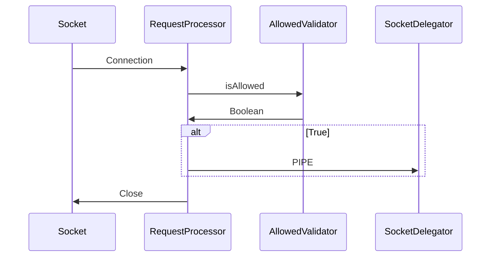
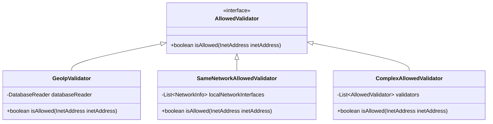

## CCTV 프록시 서버 개발 배경
### 사건의 발단
본가의 CCTV 에서 주기적으로 삐삐 소리가 발생했다.  
CCTV GUI 를 이용하여 로그를 확인해보았는데 불특정 다수가 로그인을 시도하고 성공하는 로그와 펌웨어 업데이트 시도, 업데이트 실패 후 재부팅 로그가 저장되어 있었다.  
조금 더 지켜보다가 펌웨어 업데이트 시도를 직접 목격하게 되었고 실패와 재부팅이 이루어졌다.  
그리고 부팅시 삐삐 소리가 울리는 것을 확인하였다.  
결국 원인은 누군가가 CCTV 로 로그인하여 펌웨어 업데이트를 시도했고 업데이트의 실패로 인해 재부팅되는 것이었다.  

### 간단한 방지책
원인을 알았으니 방지책을 하나 세우기로 하였다.  
로그에서 로그인을 시도하는 IP 를 알 수 있었기 때문에 해당 IP 를 밴을 때려버리면 어떨까 싶었다.  
당장 공유기의 설정에서 패킷 필터를 적용하여 해당 IP 들을 밴시켜버렸다.  
그런데.. 'IP 들?'  
그렇다. 로그인 시도를 하는 IP 는 하나둘이 아니었다.  
업데이트를 시도하는 IP 도 있었고 일부는 그저 로그인, 로그아웃만을 반복하는 IP 도 있었다.  
당연한 결과이지만 잠깐 동안은 문제가 해소된 것 처럼 보였지만 이후 다른 IP 로 같은 시도가 발생하고 문제는 재발하였다.  

### 1차 문의
해당 문제를 해결하기 위해 업체에 연락을 시도했지만 우리집만의 문제가 아닌 모양이라 문의가 몰려 대응을 받을 수가 없었다.  
다만 대응 방안으로 공지사항이 올라오게 되었다.  
수동으로 펌웨어를 업데이트한 후 비밀번호를 재설정하라는 것이었다.  
펌웨어 다운로드 사이트에서 CCTV 모델에 맞는 펌웨어를 다운받아 업데이트를 완료하였다.  
물론 비밀번호 변경까지도 완료하였다.  
다행히도 CCTV 의 재부팅은 더 이상 발생하지 않았다.  

### 아직 남은 찜찜함
하지만 펌웨어의 업데이트와 비밀번호의 변경이 재부팅은 막을 수 있었지만 근본적인 원인을 제거할 수 있었을까? 하는 의구심이 들어서 조금 더 로그를 모니터링 했다.  
확인 결과 외부에서 로그인 시도는 계속 이어졌다.  
다만 비밀번호를 변경해서인지 로그인에 실패하였기 때문에 업데이트 시도를 할 수 없고, 결과 재부팅이 되지 않는 것이었다.  
문제였던 증상은 해결이 되었는데 근본적인 원인은 해결되지 않아 찜찜함이 해소되지가 않는다.  

### 2차 문의
이 근본적인 해결책을 제시해줄 수는 없는지 추가 문의를 시도했다.  
현재의 상황인 재부팅은 발생하지는 않지만 근본적인 원인이 되는 로그인시도가 계속된다고 문의드리며 혹시라도 fail2ban 과 같은 방지책이 없을지 문의하였다.  
하지만 업체에서는 해결방법이 없다며 당장의 재부팅은 해소가 되었고 로그인을 시도는 하지만 실패를 하는 것이기 때문에 그냥 무시해라 라는 답변을 받게 되었다.  
굉장히 무책임하다는 느낌을 받으며 화가 났지만 방법이 없다는데 어쩌겠나 싶어 소득 없이 문의를 종료하게 되었다.  

### 방법이 없을까?
이대로 끝내기는 뭔가 찜찜하다.  
정말 방법이 없을까?  
일단 도대체 어떤 요청이 오는걸까?  
당장 서버를 하나 만들어 포트포워딩을 변경하여 CCTV 대신 요청을 받아낼 서버를 만들었다.  
하지만 CCTV 에 대한 요청으로 생각되는 요청은 HTTP 통신이 아닌 듯 하여 방금 만든 SpringMVC 기반의 서버에서 요청을 확인할 수 없었다.  
이에 새롭게 소켓 서버를 열어 HTTP 통신인 경우와 단순 패킷 통신인 경우 로깅을 차별화하여 어떤 데이터들이 들어오는지 확인하였다.  
결과 ByteArray 와 JSON 데이터가 합쳐진 데이터양식이 확인되기 시작했다.  
JSON 의 내용들로 유추하건데 CCTV 에 대한 요청이 맞는 것 같고 일부는 로그인시도로 보이는 요청도 있었다.  
의외인 점은 로그인시도의 비밀번호는 한가지 뿐이었고 이는 기존의 우리집 비밀번호와 너무나도 상이했다.  
어쩌면 이전 펌웨어 버전의 마스터 비밀번호 쯤 되지 않을까? 예상이 된다.  
어떤 요청들이 들어오는지는 대략적으로 알았지만 그렇다고 해결방안이 있는 것은 아니었다.  
그저 저런 악의적인 요청이 외국에서 온다는 점만을 알게 되었다.  
어? 외국? 우리는 어짜피 한국에 살기 때문에 대체로는 한국에서 CCTV 를 확인하지 않나?  
외국 IP 를 거부하면 어떨까?  

## CCTV 프록시 서버 개발 시작
### 외국 IP 를 거부하는 프록시 서버를 만들어보자
물론 완전한 해결책이 되지는 않을 것이다.  
하지만 이래도 안돼 저래도 안돼 하는 것 보다 뭐든 해봐야하지 않을까?  
악의적인 요청은 외국에서 많이 들어오니까 외국 IP 는 거절하고 한국에서 요청한 경우에만 실제 CCTV 로 패킷을 PIPE 시켜주면 되지 않을까 하는 아이디어를 기반으로 개발을 시작하였다.  

### IP 로 지역을 어떻게 구분할까?
GeoIP 라는 서비스가 있었다.(https://www.maxmind.com/en/home)  
API 를 제공하기도 하고 IP 로 지역을 쿼리할 수 있는 DB 파일을 제공해주기도 한다.  
아마도 Web API 는 유료서비스인 것 같아서 DB 파일을 다운받아 사용하는 방향으로 정했다.  
물론 DB 또한 무료인 GeoLite2 를 사용하였다.  

```java
File database = new File("/path/to/maxmind-database.mmdb")

// This reader object should be reused across lookups as creation of it is
// expensive.
DatabaseReader reader = new DatabaseReader.Builder(database).build();

// If you want to use caching at the cost of a small (~2MB) memory overhead:
// new DatabaseReader.Builder(file).withCache(new CHMCache()).build();

InetAddress ipAddress = InetAddress.getByName("128.101.101.101");

CityResponse response = reader.city(ipAddress);

Country country = response.getCountry();
System.out.println(country.getIsoCode());
```
- 출처: [GeoIP Developers Database](https://dev.maxmind.com/geoip/geolocate-an-ip/databases/)
- 위와 같이 DB 파일을 이용하여 지역 정보를 조회할 수 있다.

### 동작 방식
매우 간단하다.  
Socket 서버를 열어 요청이 들어오게 되면 클라이언트의 IP 를 기준으로 허용 여부를 판별하고 허용 가능하다면 CCTV 와 연결해주고 불허한 경우는 바로 연결을 끊어버린다.  



### 로컬 IP 는 검색이 되지 않는다.
집안에서도 CCTV 를 확인하고 싶을 수 있다.  
하지만 집안의 로컬 IP 는 말 그대로 로컬대역이기 때문에 외부의 IP 와는 다르다.  
고로 GeoIP 를 통해 조회가 불가능하다.  
때문에 로컬 대역인 경우에 대한 예외처리가 필요했다.  



이미 AllowedValidator 가 허용여부를 검사하는 인터페이스이기 때문에 추가적으로 로컬 네트워크를 검사하는 구현체를 추가한다.  
그리고 두 경우의 수를 동시에 체크해야하기 때문에 여러 검사를 동시에 할 수 있는 ComplexAllowedValidator 를 사용한다.(사실 이름을 조금 더 잘 지어야 했지만 아쉽게도..)  

### 요청과 응답 PIPE
허용된 요청에 대해서는 CCTV 와의 통신내용을 전달해주어야 한다.  

```java
@Slf4j
@Component
public class SocketDelegator {

    private final ExecutorService executor;

    public SocketDelegator(ExecutorService executor) {
        this.executor = executor;
    }

    public void asyncPipeSocket(Socket from, Socket to) {
        executor.submit(() -> {
            try (InputStream fromInputStream = from.getInputStream();
                 OutputStream toOutputStream = to.getOutputStream()) {
                fromInputStream.transferTo(toOutputStream);
            } catch (IOException e) {
                log.error("PipeSocket Close failed. maybe already closed", e);
            }
        });
    }

    public void awaitPipeSocket(Socket from, Socket to) {
        try (InputStream fromInputStream = from.getInputStream();
             OutputStream toOutputStream = to.getOutputStream()) {
            fromInputStream.transferTo(toOutputStream);
        } catch (IOException e) {
            log.error("PipeSocket Close failed. maybe already closed", e);
        }
    }
}
```
InputStream 의 transferTo 를 이용하여 각 요청을 그대로 전달해준다.  
요청과 응답에 대해서 둘 다 적용되어야 하기 때문에 Client->Server, Server->Client 에 대해서 각각 수행해주어야 한다.  
하지만 둘 중 하나는 동기방식으로 수행이되어야 해당 스레드가 종료되지 않기 때문에 async 와 await 를 구분하여 사용하도록 하였다.  
아쉬운 점 중 하나가 직접적으로 통신을 관리하는 것이 아니기 때문에 통신의 종료를 우아하게 처리할 수 없다는 부분이다.  
서로 연결된 그들이 어떻게 통신을 끝내는지 알 수 없기 때문에 IOException 을 캐치하는 정도로 커버를 할 수 밖에 없을 것 같다.  

### 완성
벌써? 애초에 기능이 크지 않다.  
그저 요청이 들어오면 검증->전달 이 전부이다.  

```text
2024-10-25T01:12:59.093+09:00  INFO 32384 --- [CCTVProxy] [     virtual-36] com.cctvproxy.server.RequestProcessor    : RequestProcessor started[/92.249.48.232]
2024-10-25T01:12:59.095+09:00  INFO 32384 --- [CCTVProxy] [     virtual-36] c.c.allowedvalidator.ComplexValidator    : [92.249.48.232] validation failed
2024-10-25T01:12:59.095+09:00  INFO 32384 --- [CCTVProxy] [     virtual-36] com.cctvproxy.server.RequestProcessor    : RequestProcessor closeSocket[/92.249.48.232]
```
- 정상적으로 필터링이 동작하는 것을 확인할 수 있었다.  

사실 아직 완성이라고는 할 수 없다.  
현재로는 로컬 PC 에서 돌려본 것이라서 실제 적용하기 위해서는 라즈베리파이와 같은 소형 물리적 서버를 이용하여 24시간 동작시킬 수 있도록 해야 한다.  
집에 남아있는 라즈베리파이를 이용해서 실적용을 해보는 일이 남아있다.  

### 아쉬운 점
이 방법은 완전한 해결방법은 아니다.  
한국에서 악의적 요청을 보낸다면 당연히 통과된다.  
만들고 나서 좀 더 나은 방법이 없을까 고민해보았는데 WhiteList 를 관리하는 서버를 이용하는 방법이 있을 것 같다.  
WhiteList 를 관리하는 서버와 자신의 IP 를 WhiteList 에 등록시키는 어플리케이션을 이용해 CCTV 를 보고 싶을 때 자신을 WhiteList 에 등록시키고 시청, 시청 완료 후 WhiteList 에서 삭제  
마치 VPN 을 켜고 끈다 와 비슷한 느낌으로 사용할 수 있지 않을까 싶은데 이동 중에는 어떻게 대처할지 좀 더 고민해봐야 할 것 같다.  
